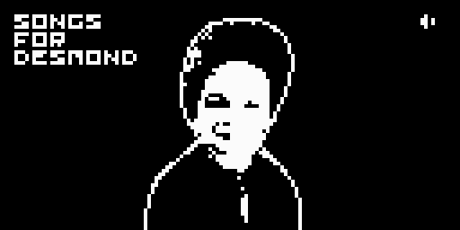
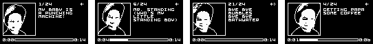

# Songs for Desmond

One thing nobody tells you about being a parent is that, as you go about the day taking care of your kid, you absentmindedly sing little songs about almost every little thing they do. The other thing nobody tells you is that the songs... are _good_.

"Songs for Desmond" collects my son's songs into a kind of 1 bit love letter: a 24 track album of minimalist square wave melodies, released exclusively on an [Arduboy game console](https://www.arduboy.com/)\* that he can carry around with him.

<small>(\* jk, you can [play it online too](https://tiberiusbrown.github.io/Ardens/player.html?file=https://github.com/rocktronica/songs_for_desmond/raw/main/songs_for_desmond.ino.hex))</small>

| Buttons      | Action |
| ------------ | ------ |
| Up / Down    | Volume |
| Left / Right | Track  |
| A            | Stop   |
| B            | Play   |

## Notes

- These are jingles for a baby->toddler sung by an often-very-tired dad, so topics are juvenile and motifs recur. At least one song is inadvertently a toy commercial jingle from the 90s. Another is a [game](https://github.com/rocktronica/any-kind-of-car-and-any-kind-of-truck) theme.
- The Arduboy's microcontroller brain is 8 bit but its display and sound outputs are 1: pixels are either on or off, square waves are either high or low. So I'd describe it as 1 bit even though that's not technically 100% correct!
- That having been said, it is possible to play two tone polyphony on the device but I like the simplicity of just one. As a graphical accompaniment, the UI's avatar dances to the song's tempo instead.
- MIDI files were made in an online editor called [Signal](https://signal.vercel.app/) and compile for the Arduboy with a `./compile_songs.sh` script.
- There's also a `./make_sprite_sheet.sh` script to convert a movie into the graphics. I think it's conceptually right but I had to do some manual pixel pushing outside it.
- I'm trying hard to get better at C++ but it doesn't come naturally to me. There are optimizations to be had, for sure.

## License

Code and general UI is MIT or as components allow.

I'm open to other game developers using the music for their work, so I could be convinced to do a CC license if there's interest. LMK.
